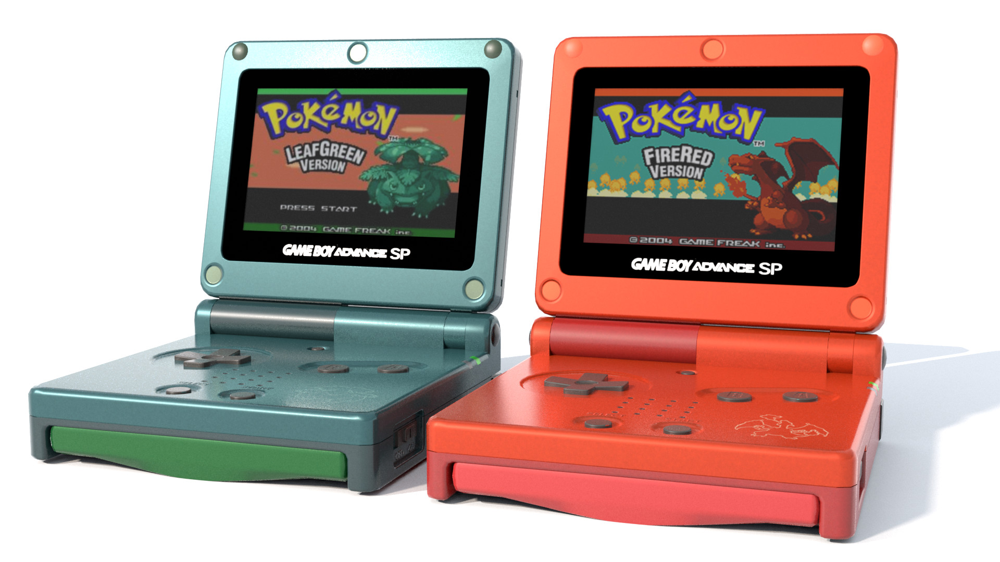

From the moment I first played the game Pokemon on my Gameboy, my love for software and gaming was cemented as it propelled me on my ICS journey through the dynamic realms of cybersecurity, data mining, and game development.

## Cybersecurity: Navigating Digital Threats
The ever-changing landscape of cybersecurity, marked by the continuous evolution of digital threats, serves as a thrilling challenge that fuels my curiosity. My journey in cybersecurity is dedicated to honing my skills in strengthening digital infrastructures. Delving into encryption methods, conducting penetration testing, and crafting incident response strategies are integral components of my quest to enhance system resilience against the ever-growing spectrum of cyber threats.

## Data Mining: Unveiling Insights
The allure of data mining captivates me as it unveils the potential to extract valuable insights from extensive datasets. My exploration involves delving into machine learning algorithms, statistical analysis, and data visualization techniques. Uncovering hidden patterns and trends within datasets for informed decision-making remains a primary interest, and I find joy in deciphering the stories that data has to tell.

## Game Development: Blending Art with Technology
On the more creative front, game development serves as an outlet for seamlessly blending technology with art. Crafting immersive gameplay experiences and coding intricate game mechanics are not just technical challenges but also opportunities for creative expression. Engaging in game development projects not only hones my programming skills but also fosters creativity and innovation, allowing me to contribute to the captivating world of interactive entertainment.

## Crafting a Unique Path Forward
Looking ahead in my journey, my goal is to intricately weave these three passions into a cohesive skill set. I aspire to secure hands-on experiences in cybersecurity practices, undertaking complex data mining projects, and actively contributing to game development endeavors. By fusing these diverse technical interests, I aim to carve a unique path that aligns with my passions and contributes meaningfully to the ever-expanding field of computer science.

In this multifaceted journey, I envision myself not just as a coder but as a storyteller, weaving narratives through secure digital landscapes, extracting tales from intricate datasets, and crafting immersive experiences that captivate and inspire in the realm of game development. As I navigate through the intersection of cybersecurity, data mining, and game development, each challenge becomes a stepping stone toward a holistic understanding of the intricate tapestry that is software Wonderland. This journey, marked by passion and purpose, is my contribution to the ever-evolving landscape of computer science.

###### Note: ChatGPT was used in fixing my grammar and spelling.
