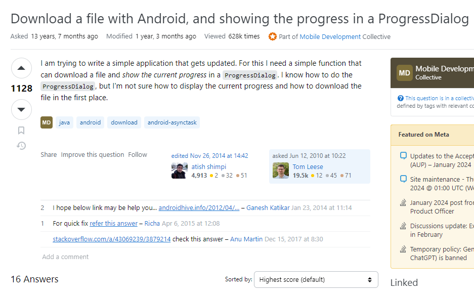

Eric Steven Raymond's guide serves as a compass for those traversing the intricate landscape of technical queries within hacking and open-source communities. The document accentuates the importance of aligning question formulation with community preferences, acknowledging the voluntary nature of assistance, and showcasing the need for efficiency in addressing questions presented by the community. In this, we delve into the guide's key principles and evaluate their application to a user's question, unearthing insights into effective questioning strategies.

## Preparation: The Foundation of Smart Questions
The guide places a significant emphasis on thorough preparation before posing questions. It advocates for a proactive approach, urging users to engage in self-help by consulting various resources—archives, web searches, manuals, and FAQs. Seeking advice from knowledgeable peers is encouraged, fostering a culture of collaboration and shared learning among community members. This preparatory phase lays the foundation for smart questions, reflecting an individual's commitment to active engagement with available information.

## Crafting Questions: Art and Science
In the realm of question formulation, the guide provides nuanced advice on selecting an appropriate forum and tailoring questions to fit the expertise of the chosen community. It emphasizes the significance of respecting community norms and understanding unique cultures and expectations within hacking and open-source communities. A caution against overwhelming multiple channels with the same question emerges as a practical insight, considering the constraints faced by volunteers in terms of time and resources. This highlights the need for users to be mindful of the community's capacity for efficient assistance.

## User's Question: A Case Study

Examining a user's question, presented by Tom Leese, reveals a clear intent to develop an application with specific functionality. While the question is articulate in its objective, it falls short of embodying the characteristics of a smart question. It needs to demonstrate prior effort, specify crucial details such as the programming language and platform (e.g., Android), and provide limited insights into the file download process. Proposing a refined version that includes information about efforts made, specifies the exact model and platform, and explicitly seeks guidance with potential code snippets becomes pivotal. This revised approach aims to not only showcase the user's initiative but also to provide essential context for more accurate responses while explicitly requesting actionable guidance for the identified challenges.

In conclusion, Eric Steven Raymond's guide is a valuable companion, offering principles that guide individuals through the intricacies of seeking technical help within the collaborative environments of hacking and open-source communities. The examination of a user's question further highlights the practical application of these principles, shedding light on the dynamics of effective questioning strategies.
