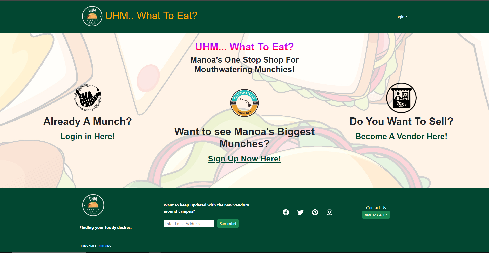

"UHM... What to Eat?" is a specialized food application tailored specifically for the University of Hawaii at Manoa campus, cleverly incorporating the campus acronym, UHM, into its title. The app addresses the perennial question of what to eat by streamlining the process of discovering and selecting food options available across various campus dining locations, including the campus center, food trucks, Manoa Gardens, and Paradise Palms.

## Key Features:

User Roles: The app caters to different user roles, including Users, Vendors, and Admins, each with distinct functionalities tailored to their needs.
User Functions: Users have the ability to explore food vendors based on location or food category, favorite preferred vendors for easy access, and view detailed vendor information.
Vendor Functions: Vendors are empowered to create and edit their profiles, which include essential details such as store name, location, hours of operation, menu items, and even recommended dishes.
Admin Functions: Admins oversee the entire system, possessing edit access to all vendors and user accounts. This enables them to maintain system integrity and ensure smooth operation.
Categories and Photos: The app offers broad categories for vendors based on the types of food they offer, facilitating easy navigation for users. Furthermore, vendors can enhance their profiles with photos, showcasing their offerings in an enticing manner.
User Guide:

## The app provides a comprehensive user guide, ensuring a seamless experience for all stakeholders:

Getting Started: Users can register or log in to access the app and begin exploring dining options.
Explore Vendors: Users can discover vendors across the campus, filter them by location or category, and mark their favorites for quick access.
Using the App: Users can browse menus, search and filter for specific items, check real-time availability, and manage their favorites to suit their preferences.
Vendor Features: Vendors are equipped with tools to update menus, manage profiles, and adjust offerings as needed, empowering them to maintain up-to-date and engaging profiles for users.
In essence, "UHM... What to Eat?" revolutionizes the dining experience at UH Manoa by providing a centralized platform that caters to the diverse needs of users, vendors, and administrators alike, ensuring a satisfying and efficient food selection process for all.

Source: <a href="https://uhm-what-to-eat.github.io/"><i class="large github icon "></i>uhm-what-to-eat.github.io</a>
