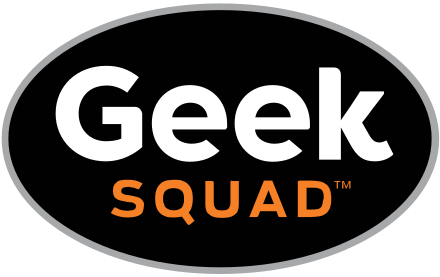

"UHM... What to Eat?" is a food application tailored for the University of Hawaii at Manoa campus, cleverly playing on the campus acronym, UHM, and the perpetual question of what to eat. It streamlines the process of discovering and selecting food options available across campus dining locations, including campus center, food trucks, Manoa Gardens, and Paradise Palms.

## Key Features:

User Roles: Users, Vendors, and Admins.
User Functions: Users can explore food vendors based on location or food category, favorite preferred vendors, and access vendor information.
Vendor Functions: Vendors can create/edit their profiles, including store name, location, hours, and menu items.
Admin Functions: Admins oversee the system, with edit access to all vendors and user accounts.
Categories: Broad categories for vendors based on the types of food they offer.
Photos: Supports photo uploads for vendors and menu items.
User Guide:

## Getting Started: Register/Login to access the app.

Explore Vendors: Discover vendors across campus, filter by location or category, and favorite preferred vendors.
Using the App: Browse menus, search/filter for specific items, check real-time availability, and manage favorites.
Vendor Features: Vendors can log in to update menus, manage profiles, and adjust offerings as needed.
In essence, "UHM... What to Eat?" simplifies the dining experience at UH Manoa by providing a centralized platform for users to explore diverse food options, vendors to manage their offerings, and admins to oversee the system.
