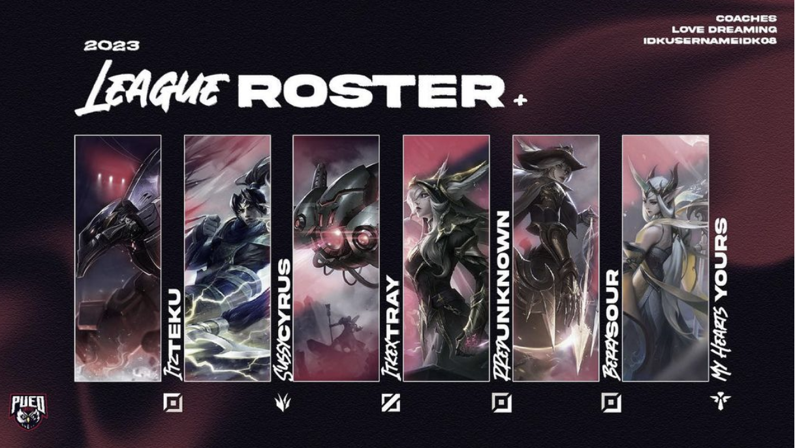

## Embracing the Esports Rollercoaster
Being a part of an Esports team is a thrilling rollercoaster of excitement, filled with exhilarating highs and occasional challenges. Competing on a collegiate level against schools from across the country brings unmatched thrills, accompanied by a unique sense of pride in representing our school and striving to establish ourselves as champions in the Esports arena. The camaraderie formed within the team further enhances the overall experience, uniting us in the pursuit of victory.

## Balancing Act: Student and Esports Athlete
However, this thrilling journey comes with its share of complexities, notably the delicate balance of being a full-time student while actively participating in tournaments and committing to 3-4 practice days. This dual commitment not only tests our gaming skills but also serves as a crash course in effective time management and project coordination. Juggling academic responsibilities with Esports demands a strategic approach to ensure success in both arenas.

## Developing Project Management Skills
Esports, at its core, is a series of projects – each game, each tournament, is a project with specific goals and timelines. Engaging in Esports hones project management skills, teaching players how to plan, execute, and adapt in a dynamic environment. These skills prove invaluable not only in the gaming world but also in academic pursuits and professional endeavors.

In conclusion, the meticulous planning, coordination, and holistic learning experienced within an Esports team not only elevates my gaming prowess but also equips individuals with skills that transcend the virtual realm, influencing success in various facets of life.
